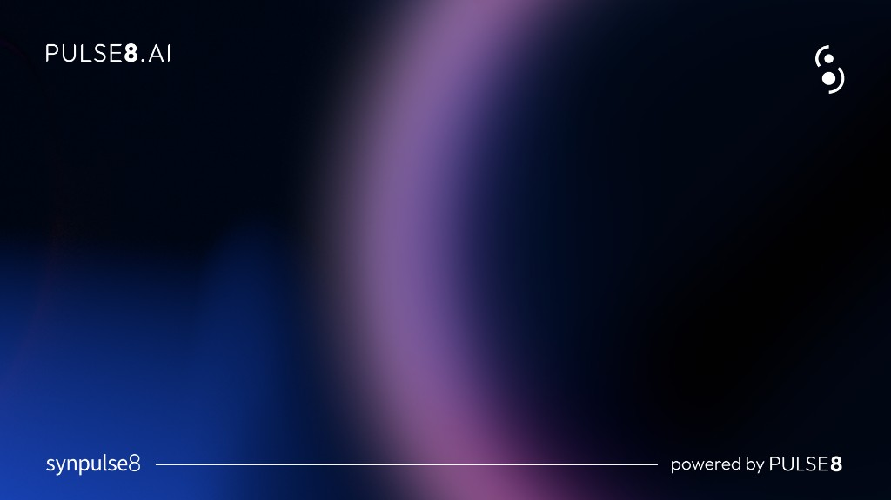

<p align="center">
  
</p>

<h1 align="center">PULSE8.ai Cortex</h1>

<p align="center">
  <strong>Agent-native knowledge OS built on Markdown</strong>
</p>

<p align="center">
  <a href="https://github.com/synpulse8-opensource/pulse8-ai-cortex-knowledge-vault/actions/workflows/pylint.yml"></a>
  <a href="https://github.com/synpulse8-opensource/pulse8-ai-cortex-knowledge-vault/releases/latest"></a>
  <a href="LICENSE.md"></a>
</p>

<p align="center">
  
  
  
  
  
</p>

PULSE8.ai Cortex is an agent-native knowledge OS built on Markdown. It gives AI agents and humans a shared vault backed by a typed knowledge graph, full-text search, and a [MarkItDown](https://github.com/microsoft/markitdown)-powered compiler — all accessible through a unified [MCP](https://modelcontextprotocol.io/) interface.

Drop files in (PDF, DOCX, PPTX, XLSX, HTML, images, and more), let agents read, write, search, link, and compile knowledge — no database required.

> Inspired by [Andrej Karpathy](https://github.com/karpathy)'s [LLM Wiki](https://gist.github.com/karpathy/442a6bf555914893e9891c11519de94f) pattern — a persistent, compounding knowledge base maintained by LLMs instead of re-derived on every query. Search powered by [Tobi Lütke](https://github.com/tobi)'s [QMD](https://github.com/tobi/qmd).

## Get started

> [!NOTE]
> PULSE8.ai Cortex requires Docker. An [OpenRouter API key](https://openrouter.ai/keys) is optional — needed only for LLM-powered cross-referencing between wiki articles. File conversion works out of the box without any API key.

1. Clone the repository:
  ```bash
    git clone https://github.com/pulse8-ai/cortex-knowledge-vault.git
    cd cortex-knowledge-vault
  ```
2. Launch PULSE8.ai Cortex:
  ```bash
    ./scripts/start.sh
  ```
    This builds and starts both **PULSE8.ai Cortex** (API + MCP on `:8420`) and **QMD** (search on `:3100`), waits for health checks, and you're ready to go.
3. Connect your MCP client (e.g. Claude Desktop) to `http://localhost:8420/mcp/`.

To stop: `./scripts/stop.sh`

## Features


|                      |                                                                                                         |
| -------------------- | ------------------------------------------------------------------------------------------------------- |
| **Knowledge Graph**  | Typed graph engine (NetworkX) — wikilinks, tags, and custom edges, auto-maintained on every file change                  |
| **Full-Text Search** | BM25 keyword search via QMD with optional hybrid (vector + reranking) mode                                               |
| **File Compiler**    | Converts raw sources (PDF, DOCX, PPTX, XLSX, HTML, images, etc.) to Markdown via [MarkItDown](https://github.com/microsoft/markitdown). LLM used only for cross-referencing. |
| **MCP Server**       | Streamable HTTP + stdio transport — works with Claude Desktop, Cursor, and any MCP client                                |
| **REST API**         | FastAPI endpoints mirroring all MCP tools at `/api/v1/`, including multipart file upload                                 |
| **Vault Watcher**    | Real-time filesystem monitoring — graph stays in sync automatically                                                      |
| **Zero Database**    | Everything persists as Markdown + JSON on your filesystem                                                                |


## MCP tools


| Tool            | Description                                                        |
| --------------- | ------------------------------------------------------------------ |
| `vault_read`    | Read a note by path                                                |
| `vault_write`   | Create or update a note                                            |
| `vault_search`  | Search the vault (keyword / semantic / hybrid)                     |
| `vault_link`    | Create, query, or delete graph edges                               |
| `vault_context` | Build a context window: search → graph traversal → ranked subgraph |
| `vault_ingest`  | Ingest raw content or binary files (supports `content_base64` for binary) |
| `vault_compile` | Compile unprocessed raw sources into wiki Markdown via MarkItDown         |


## Architecture

```
┌──────────────────────────────────────────────┐
│  MCP Client (Claude Desktop, Cursor, etc.)   │
└──────────┬───────────────────────────────────┘
           │  MCP (HTTP or stdio)
┌──────────▼───────────────────────────────────┐
│  PULSE8.ai Cortex  :8420                     │
│  ┌─────────┐ ┌──────────┐ ┌──────────────┐   │
│  │ MCP     │ │ REST API │ │ Vault Watcher│   │
│  │ /mcp/   │ │ /api/v1/ │ │ (watchfiles) │   │
│  └────┬────┘ └────┬─────┘ └──────┬───────┘   │
│       └───────────┼──────────────┘           │
│            ┌──────▼──────┐                   │
│            │ Graph Engine│                   │
│            │ + Compiler  │                   │
│            └─────────────┘                   │
└──────────┬───────────────────────────────────┘
           │
┌──────────▼───────────────────────────────────┐
│  QMD  :3100                                  │
│  BM25 + vector search, auto-indexes on start │
└──────────┬───────────────────────────────────┘
           │
┌──────────▼───────────────────────────────────┐
│  Vault (bind-mounted volume)                 │
│  wiki/ raw/ agents/ sessions/ daily/         │
│  .cortex/ (graph.json, index.md, log.md)     │
└──────────────────────────────────────────────┘
```

## Configuration

Copy the example and fill in your values:

```bash
cp .env.example .env
```


| Variable                       | Required | Default                        | Description                                          |
| ------------------------------ | -------- | ------------------------------ | ---------------------------------------------------- |
| `LLM_API_KEY`                  | No       | —                              | OpenRouter (or compatible) API key (for cross-referencing only) |
| `COMPILER_MODEL`               | No       | `anthropic/claude-sonnet-4`    | Model for cross-reference detection                             |
| `LLM_BASE_URL`                 | No       | `https://openrouter.ai/api/v1` | LLM API base URL                                                |
| `VAULT_DIR`                    | No       | `./example_vault`              | Path to your vault directory                         |
| `QMD_REFRESH_INTERVAL_SECONDS` | No       | `900`                          | Periodic re-index interval (seconds; `0` to disable) |


`OPENROUTER_API_KEY` and `CORTEX_LLM_API_KEY` are accepted as aliases for `LLM_API_KEY`.

## MCP client setup

### Claude Desktop

An example config is included at `[claude_desktop_config.example.json](claude_desktop_config.example.json)`.

**HTTP (recommended)** — PULSE8.ai Cortex runs as a persistent server:

```json
{
  "mcpServers": {
    "cortex": {
      "url": "http://localhost:8420/mcp/"
    }
  }
}
```

**Stdio** — Claude Desktop launches the server on demand:

```json
{
  "mcpServers": {
    "cortex": {
      "command": "uv",
      "args": ["run", "--project", "/path/to/cortex", "python", "-m", "cortex.mcp"],
      "env": {
        "CORTEX_VAULT_PATH": "/path/to/your/vault"
      }
    }
  }
}
```

## Development

```bash
# Install dependencies
uv sync --all-extras

# Run tests
uv run pytest tests/ -v

# Run shell tests (requires bats-core)
bats tests/test_start_sh.bats

# Start PULSE8.ai Cortex locally (without Docker)
CORTEX_MCP_TRANSPORT=http CORTEX_VAULT_PATH=./example_vault uv run python scripts/serve.py
```

### Utility scripts


| Script               | Description                                                |
| -------------------- | ---------------------------------------------------------- |
| `scripts/serve.py`   | Dev server (HTTP or stdio based on `CORTEX_MCP_TRANSPORT`) |
| `scripts/compile.py` | Batch-compile all raw sources                              |
| `scripts/reindex.py` | Full reindex + graph rebuild                               |
| `scripts/lint.py`    | Lint vault structure                                       |


## How it works

**Watcher** and **Compiler** are independent components:

- The **Watcher** maintains the graph. Any `.md` file added, modified, or deleted triggers automatic node/edge updates.
- The **Compiler** converts raw source files to Markdown using [MarkItDown](https://github.com/microsoft/markitdown) and writes them to `wiki/`. Supported formats include PDF, DOCX, PPTX, XLSX, HTML, CSV, JSON, XML, images (EXIF/OCR), and plain text. The LLM is only used for optional cross-reference detection between articles.

They connect indirectly: the compiler writes to `wiki/`, the watcher picks those up and updates the graph.

### Supported file formats

| Format | Extensions |
| ------ | ---------- |
| PDF | `.pdf` |
| Microsoft Word | `.docx` |
| Microsoft PowerPoint | `.pptx` |
| Microsoft Excel | `.xlsx`, `.xls` |
| HTML | `.html`, `.htm` |
| Text-based | `.csv`, `.json`, `.xml`, `.txt`, `.md` |
| Images | `.jpg`, `.png`, etc. (EXIF metadata) |

**Search** uses a two-stage pipeline:

1. **QMD** performs keyword/semantic search on file contents
2. **PULSE8.ai Cortex** enriches results with graph edges (wikilinks, tags, relationships between matched notes)

QMD answers *"what's relevant?"* — the graph answers *"how are these results connected?"*

## Data persistence

The vault directory is bind-mounted from your host into the containers. All data lives on your local disk and survives container restarts.

The QMD search index is stored in a Docker volume (`qmd-cache`). To force a full re-index:

```bash
docker compose down -v
./scripts/start.sh
```

## Contributing

We welcome contributions! Please open an issue to discuss your idea before submitting a pull request.

```bash
# Fork and clone the repo
git clone https://github.com/<your-username>/cortex-knowledge-vault.git
cd cortex-knowledge-vault

# Create a branch
git checkout -b feat/my-feature

# Install dev dependencies
uv sync --all-extras

# Make changes, then run tests
uv run pytest tests/ -v

# Submit a pull request
```

## Reporting issues

Use [GitHub Issues](https://github.com/pulse8-ai/cortex-knowledge-vault/issues) to report bugs or request features.

## Acknowledgements

PULSE8.ai Cortex builds on ideas and tools from the open-source community:

- **[LLM Wiki](https://gist.github.com/karpathy/442a6bf555914893e9891c11519de94f)** by [Andrej Karpathy](https://github.com/karpathy) — the core pattern of an LLM-maintained, persistent knowledge base that compiles and interlinks knowledge incrementally rather than re-discovering it from raw documents on every query. This gist is the direct inspiration for Cortex's architecture.
- **[QMD](https://github.com/tobi/qmd)** by [Tobi Lütke](https://github.com/tobi) — the on-device search engine powering all full-text and hybrid search in Cortex. QMD combines BM25, vector search, and LLM re-ranking, all running locally.
- **[MarkItDown](https://github.com/microsoft/markitdown)** by [Microsoft](https://github.com/microsoft) — the file-to-Markdown converter powering the Cortex compiler. Converts PDF, Office documents, HTML, images, and more into structured Markdown for ingestion into the vault.

## License

This project is licensed under the [PULSE8.ai Cortex Open Source License](LICENSE.md) (Apache License 2.0 with additional terms).